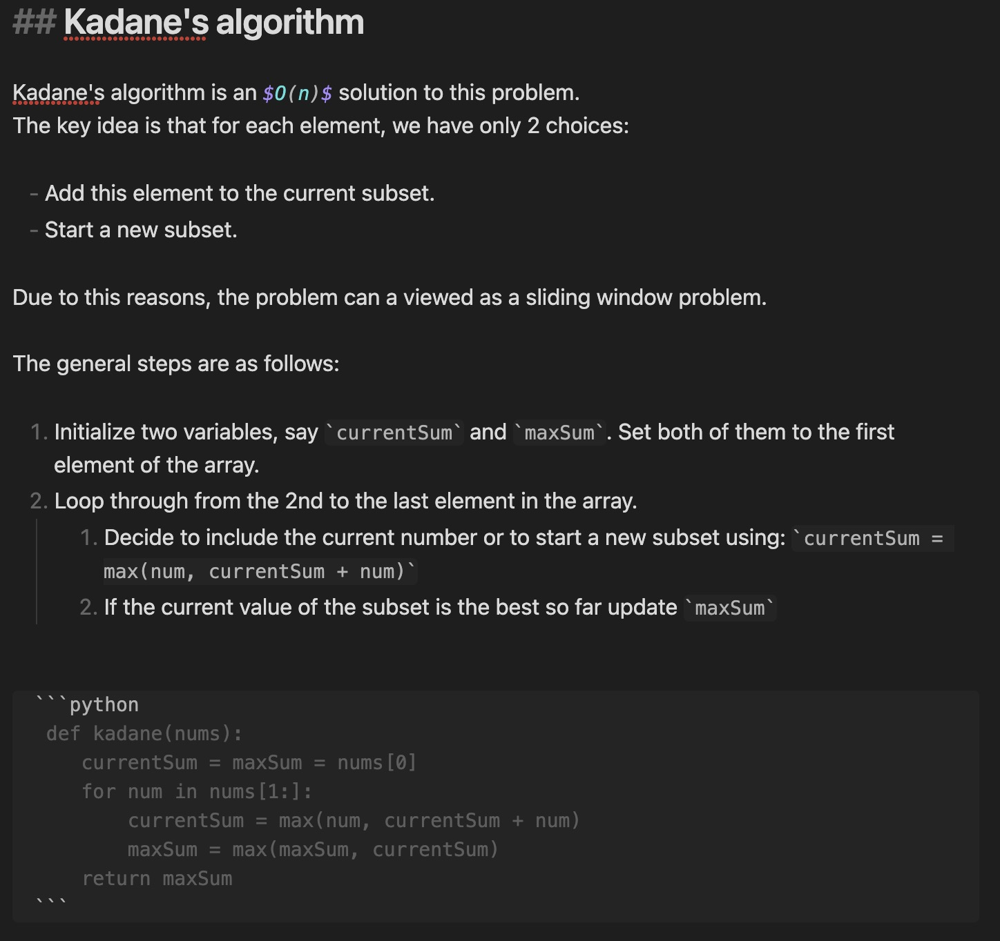
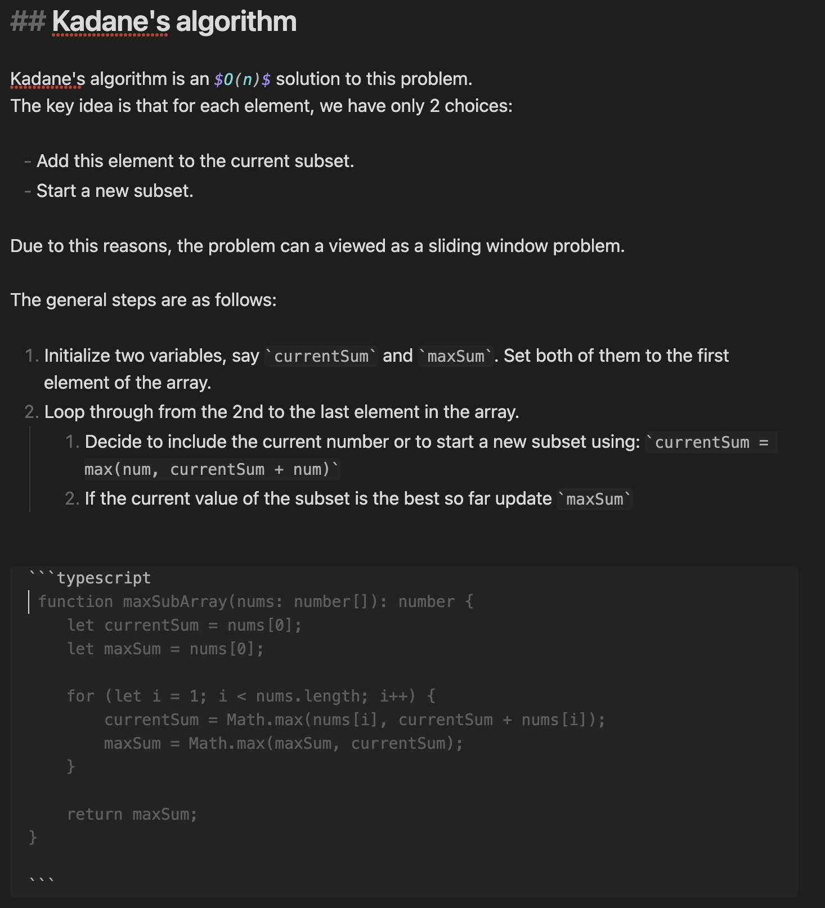

# How does the model work in details?
We use large language models (LLM) to preform fill-in-the-middle auto-completion.
LLM don't do fill-in-the-middle auto-completion out of the box, since (most) LLMs are not trained to do this.
So, we use various prompt engineering techniques to make the LLMs do fill-in-the-middle auto-completion.

### System prompt
The prediction task has been formulated as a mask replacement task.
Using prompt engineering, we can make a Chat-LLM model to perform this task.
To do this, we give the model the following system instructions:

```text
Your job is to predict the most logical text that should be written at the location of the <mask/>.
Your answer can be either code, a single word, or multiple sentences.
Your answer must be in the same language as the text that is already there.
Your response must have the following format:
THOUGHT: here, you reason about the answer; use the 80/20 principle to be brief.
LANGUAGE: here, you write the language of your answer, e.g. English, Python, Dutch, etc.
ANSWER: here, you write the text that should be at the location of <mask/>.
```

We then provide the model with the (truncated) text before and after the cursor in the format `<truncated_text_before_cursor> <mask/> <truncated_text_after_cursor>`.
For example, the user message to the model for the Attention formula in the example above would be:

```text
Weighted average of (sequence) elements, with the weights dynamically computed based on an input query and elements' keys. 

The attention weight $a_i$ is calculated as follows:
$$
<mask/>
$$

In this formula we have the following components:
- Value: For each element, we have a feature vector per element we want to average over.
- Score function  $f_{score}(key, query)$: uses the queries and keys to calculate the weights per value. (Typically a simple similarity metric or MLP.)
- Attention weight $\alpha_i$: the amount of attention to put on value $i$.
```

The model then responses with something like:

```text
THOUGHT: The </mask> is located in a math block. The text before the mask is explaining the attention weight calculation. Based on the text, my answer should be the formula for calculating the attention weight using the score function. 
ANSWER: \alpha_i = \frac{\exp(f_{score}(key_i, query))}{\sum_j \exp(f_{score}(key_j, query))}
```

The thought part helps the model to reason about the task and focuses the attention mechanism on the relevant parts of the text.
However, the thought part is not very useful for the user.
So, we remove this part. As a result, the suggestion only contains the generated text after the `ANSWER:` part.

As you can see in the above example, the model only has access to the text in the current document.
This prevents the model from leaking information from other documents that might be privacy-sensitive. 

### Context-aware few shot examples
The above model setup already works quite well, but it can be improved by using context-aware few-shot examples.
The key idea here is that we expect specific types of answers at specific locations in the document.
For example:
- In a math block, we expect latex formulas.
- In a code block, we expect code in the same language as the code block.
- In a list, we expect a new list item.
- In a heading, we expect a new heading that represents the paragraph's content.
- In a paragraph, we expect a new sentence consistent with the text around it.
- etc.

You can probably think of many more examples and rules.
As a result, the system prompt can become long and complex.
Instead, it is easier to prevent this by giving the model some example input and output pairs.
These pairs implicitly show the model what you expect in the response for the given context.
For example, we give the model the following example in a math block.

Input:
```text
# Sample mean
The sample mean, or sometime called average, is defined as:

$$
sample_mean(x) = <mask/>
$$
The average value has the property that 50% of the weighted* value will be above and below it. This weighted property can make it more sensitive to outliers than the median.
```

Output:
```text
THOUGHT: The </mask> is located in math block. Based on the text before and after the mask my answer should be the latex formula for the sample mean. 
ANSWER: \frac{1}{n} \sum_i^n x_i
```

This example is math block specific, so this example will only be included if the cursor is in a math block.
Besides math blocks, we also support a wide range of other contexts, such as:
- Math blocks;
- Code blocks;
- Numbered lists;
- Unordered/bullet lists;
- Task lists;
- Headings;
- Normal text;
- Block quotes;
- etc.

You can find all the examples under the advanced settings.
You can also add your own examples or customize the existing ones.
This way, you tell the model about your specific writing style and expectations.
See the [advanced settings](#advanced-configuration) section for more information.


### Language Detection
The system prompt compels the model to respond with `LANGUAGE: <language>`, a directive further reinforced by the context-aware few-shot examples.
This prompt engineering strategy ensures the model considers the language of the surrounding text and encourages consistency in its responses.
While there is no 100% guarantee that the model will respond in the same language, my experience suggests that it is significantly more likely to do so.

Despite all system prompts being in English, the model is capable of providing quality suggestions in other languages. 
This presents a considerable advantage as:
- There is no need to translate the system prompts and few-shot examples into your language;
- It allows for seamless switching between languages;
- English requires fewer tokens than other languages, leading to quicker suggestions and reduced API costs.

| English                                                                                                                                                                                    | Dutch                                                                                                                                                          | Chinese                                                                                                                                                                                                    |
| ------------------------------------------------------------------------------------------------------------------------------------------------------------------------------------------ | -------------------------------------------------------------------------------------------------------------------------------------------------------------- | ---------------------------------------------------------------------------------------------------------------------------------------------------------------------------------------------------------- |
|                                                                                                                                        |                                                                                                                |                                                                                                                                                        |
| THOUGHT: The paragraph introduces Bitcoin and its unique features, emphasizing its decentralized nature and accessibility to all users. The title should reflect this introductory nature. | THOUGHT: The paragraph introduces Bitcoin as a new form of digital currency and explains its decentralized nature. The title should reflect this introduction. | THOUGHT: The paragraph provides an overview of Bitcoin, emphasizing its decentralized nature and the need for learning about its underlying technology. The title should reflect this introductory nature. |
| LANGUAGE: English                                                                                                                                                                          | LANGUAGE: Dutch                                                                                                                                                | LANGUAGE: Chinese                                                                                                                                                                                          |
| ANSWER: Introduction to Bitcoin                                                                                                                                                            | ANSWER: Introductie van Bitcoin                                                                                                                                | ANSWER: 什么是比特币？                                                                                                                                                                                     |

Note: The above examples have been generated by `Chat-GPT3.5-16k` API version `2023-07-01-preview`.

This same approach also works for code blocks and math blocks.
In the few-shot examples, for these contexts, we set the example answer equal to the programming language in the case of code blocks and LaTeX in the case of math blocks.
This makes the model more consistent in generating the correct code, while its thought section does not need to focus on language-specific implementation details.
  
| Python                                                                                                    | TypeScript                                                                                                                                                                                                                | Rust                                                                                                                                                                                                                 |
| --------------------------------------------------------------------------------------------------------- | ------------------------------------------------------------------------------------------------------------------------------------------------------------------------------------------------------------------------- | -------------------------------------------------------------------------------------------------------------------------------------------------------------------------------------------------------------------- |
|                                                        |                                                                                                                                                                      |                                                                                                                                                                     |
| THOUGHT: The code should implement Kadane's algorithm by following the steps mentioned in the description | THOUGHT: The code should implement Kadane's algorithm as described in the text. It should initialize `currentSum` and `maxSum`, then loop through the array to update these variables based on the two choices mentioned. | THOUGHT: The code should implement Kadane's algorithm as described in the text. It should initialize `currentSum` and `maxSum`, then loop through the array to update these variables based on the given conditions. |
| LANGUAGE: Python                                                                                          | LANGUAGE: TypeScript                                                                                                                                                                                                      | LANGUAGE: Rust                                                                                                                                                                                                       |
